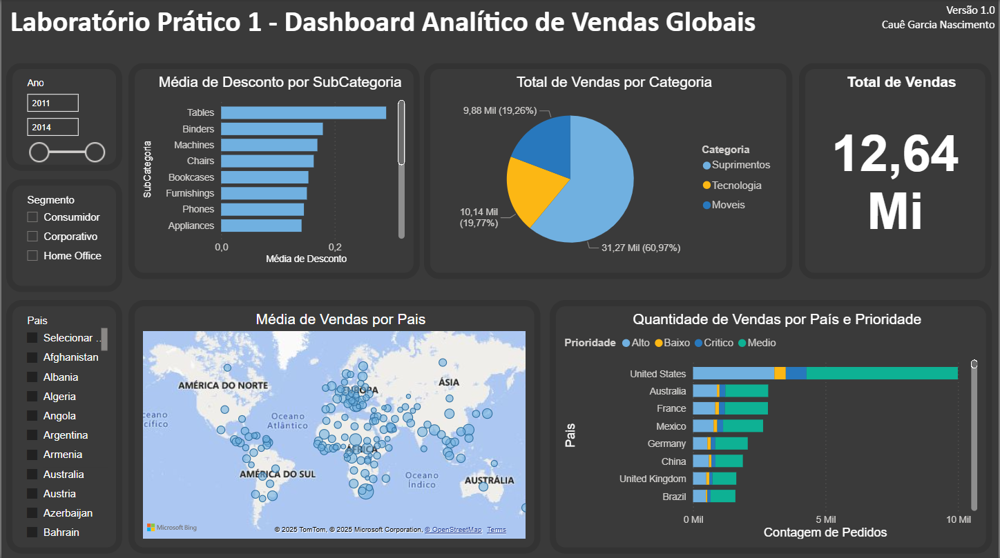

# 📊 Dashboard de Vendas Globais

### 🎯 **Objetivo do Dashboard**

Analisar o desempenho das vendas globais e identificar padrões relacionados a categorias de produtos, países e descontos aplicados, facilitando a visualização de métricas comerciais de forma clara e interativa.

---

### 📊 **Principais Indicadores**

* Valor total vendido
* Quantidade de vendas por categoria de produto
* Vendas por país considerando a prioridade de entrega
* Média de desconto por subcategoria
* Países com maior média de valor de venda (mapa geográfico)

---

### 🧠 **Insights Obtidos**

* Foi possível identificar quais **categorias concentram o maior volume de vendas**.
* O mapa evidenciou os **países com maior ticket médio**, auxiliando na definição de **estratégias regionais**.
* Observou-se **diferenças significativas na média de desconto** entre subcategorias, apontando oportunidades de ajuste nas políticas de preço.

---

### 📸 **Visual do Dashboard**

| Página 1                                       |
| ---------------------------------------------- | 
|  | 

