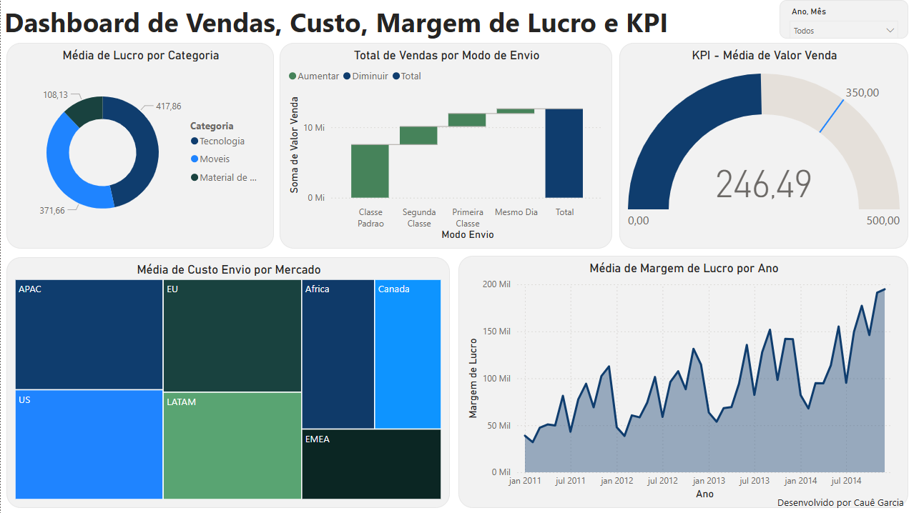

# 📈 Dashboard de Desempenho de Vendas

### 🎯 **Objetivo do Dashboard**

Analisar o desempenho financeiro e operacional das vendas, identificando padrões de lucro, custos e eficiência logística por diferentes dimensões do negócio.

---

### 📊 **Principais Indicadores**

* Média de lucro por categoria
* Total de vendas por modo de envio
* KPI de média de valor de venda
* Média de custo de envio por mercado
* Média da margem de lucro por ano

---

### 🧠 **Insights Obtidos**

* Algumas **categorias apresentaram lucro médio significativamente maior**, sugerindo maior rentabilidade em determinados segmentos.
* Observou-se **diferença de desempenho entre modos de envio**, o que pode influenciar decisões logísticas.
* A **margem de lucro média aumentou ao longo dos anos**, indicando evolução na eficiência operacional e nas estratégias de precificação.

---

### 📸 **Visual do Dashboard**

| Painel Principal                                       |
| ------------------------------------------------------ |
|  |
