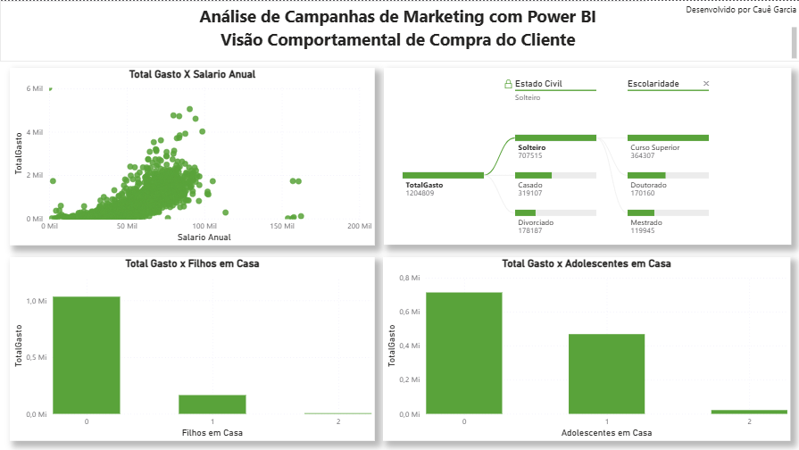
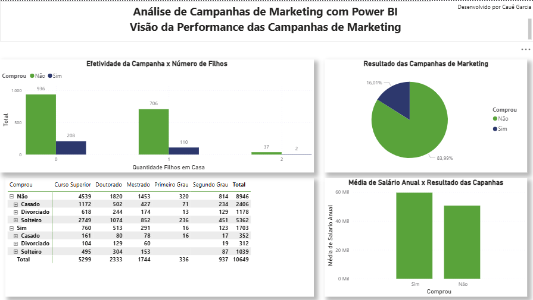
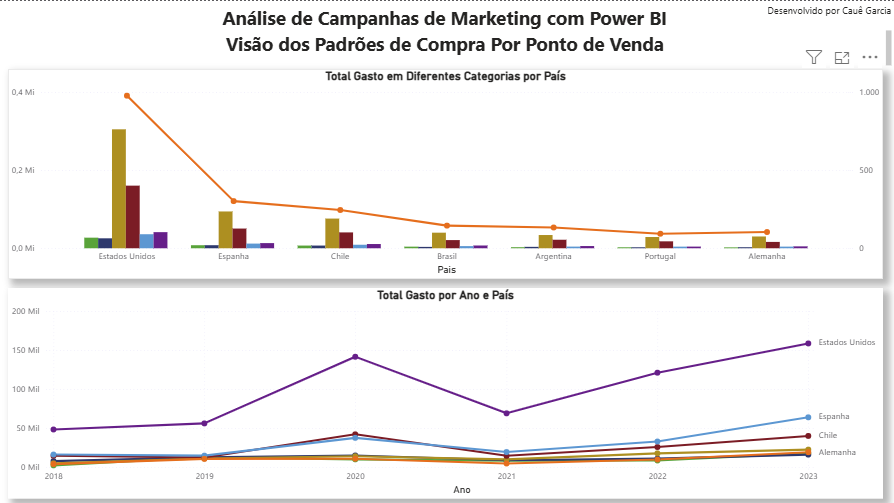

# 📊 Dashboard de Marketing e Comportamento do Cliente

### 🎯 **Objetivo do Dashboard**

Analisar o perfil, comportamento e padrões de compra dos clientes, além de avaliar a performance das campanhas de marketing, identificando fatores que influenciam o engajamento e o volume de gastos.

---

### 📊 **Principais Indicadores**

* Total de clientes, salário anual médio e volume de compras por canal (loja, web e catálogo)
* Distribuição de clientes por escolaridade e estado civil
* Relação entre gasto total, filhos e adolescentes em casa
* Efetividade das campanhas de marketing por perfil familiar e renda
* Padrões de compra por categoria, país e ano

---

### 🧠 **Insights Obtidos**

* Clientes com **maior renda e menos dependentes** tendem a gastar mais.
* A **efetividade das campanhas** varia conforme o **número de filhos e nível de escolaridade**, indicando a importância da segmentação.
* Há **diferenças claras nos hábitos de compra entre países e canais de venda**, sugerindo oportunidades de personalização das campanhas.

---

### 📸 **Visual das Visões**

<table>
  <tr>
    <td align="center"><strong>Visão Cliente</strong></td>
    <td align="center"><strong>Visão Comportamento</strong></td>
  </tr>
  <tr>
    <td></td>
    <td></td>
  </tr>
  <tr>
    <td align="center"><strong>Visão Performance de Campanhas</strong></td>
    <td align="center"><strong>Visão Padrões de Compra</strong></td>
  </tr>
  <tr>
    <td></td>
    <td></td>
  </tr>
</table>