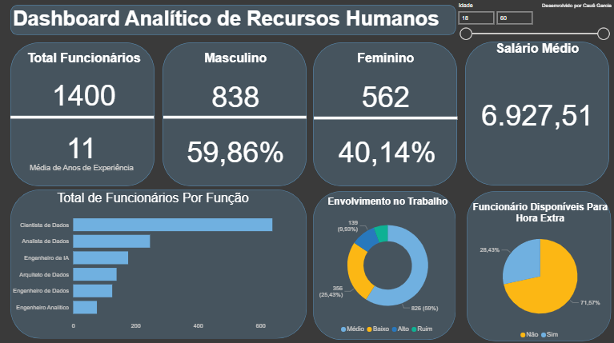

# 👥 Dashboard de Recursos Humanos

### 🎯 **Objetivo do Dashboard**

Analisar o perfil dos colaboradores e indicadores gerais da área de Recursos Humanos, com foco em experiência, funções, engajamento e disponibilidade para horas extras.

---

### 📊 **Principais Indicadores**

* Total de funcionários
* Média de anos de experiência
* Distribuição por gênero
* Salário médio dos colaboradores
* Total de funcionários por função
* Nível de envolvimento no trabalho
* Percentual de funcionários disponíveis para hora extra

---

### 🧠 **Insights Obtidos**

* A equipe é composta majoritariamente por **profissionais masculinos (838)**, com **562 colaboradoras**.
* O cargo de **cientista de dados** concentra o maior número de funcionários.
* **59% apresentam envolvimento médio**, indicando oportunidade para estratégias de engajamento.
* A maioria (**71,57%**) **não está disponível para hora extra**, o que pode impactar a capacidade de resposta a demandas emergenciais.

---

### 📸 **Visual da Visão**

| Visão Geral de RH                       |
| --------------------------------------- |
|  |
