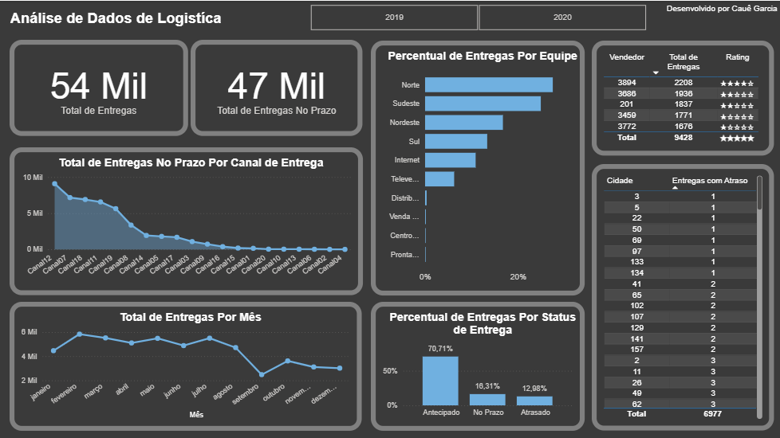

# 🚚 Dashboard de Logística e Entregas

### 🎯 **Objetivo do Dashboard**

Analisar o desempenho logístico das entregas, avaliando prazos, canais, equipes e vendedores, com o objetivo de identificar gargalos e oportunidades de melhoria na operação.

---

### 📊 **Principais Indicadores**

* Total de entregas: **54 mil**
* Entregas no prazo: **47 mil**
* Entregas no prazo por canal (Canal 12 com maior volume: **9.091**)
* Entregas por mês (picos em **julho** e **fevereiro**)
* Percentual por status de entrega (**70,71% antecipadas**)
* Distribuição por equipe (**Equipe Norte: 27,44% das entregas**)
* Vendedor com maior número de entregas (**Vendedor 3894: 2.208 entregas**)
* Cidades com mais atrasos (**Cidade 79: 589 entregas atrasadas**)

---

### 🧠 **Insights Obtidos**

* A **maior parte das entregas ocorre dentro do prazo**, com destaque para o **status antecipado (70,71%)**, indicando eficiência operacional.
* O **Canal 12** e a **Equipe Norte** se destacam pelo alto volume de entregas.
* **Meses de setembro a dezembro** apresentaram menor desempenho, sugerindo sazonalidade ou desafios logísticos.
* A **Cidade 79** requer atenção por concentrar o maior número de entregas atrasadas.

---

### 📸 **Visual da Visão**

| Visão Logística                                       |
| ----------------------------------------------------- |
|  |
