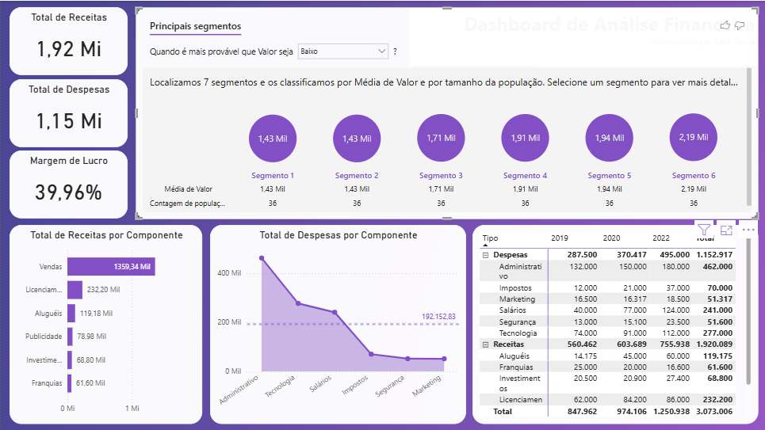

# 💰 Dashboard Financeiro

### 🎯 **Objetivo do Dashboard**

Analisar o desempenho financeiro da empresa, avaliando receitas, despesas e margem de lucro ao longo dos anos, com foco na identificação dos principais componentes e segmentos que mais impactam o resultado.

---

### 📊 **Principais Indicadores**

* Total de receitas: **R$ 1,92 milhão**
* Total de despesas: **R$ 1,15 milhão**
* Margem de lucro: **39,96%**
* Receitas por componente (**Vendas: R$ 1,36 milhão**)
* Despesas por componente (**Administrativo: R$ 462 mil**)
* Histórico anual de receitas e despesas (2019, 2020 e 2022)
* Principais segmentos de atuação

---

### 🧠 **Insights Obtidos**

* O negócio apresenta **boa margem de lucro (39,96%)**, com **receitas bem distribuídas** entre os anos analisados.
* O componente **Vendas** é o principal impulsionador das receitas, enquanto **Administrativo** representa a maior parte das despesas.
* Há **consistência no desempenho financeiro**, mas oportunidades de otimização de custos administrativos.

---

### 📸 **Visual da Visão**

| Visão Financeira                                        |
| ------------------------------------------------------- |
|  |